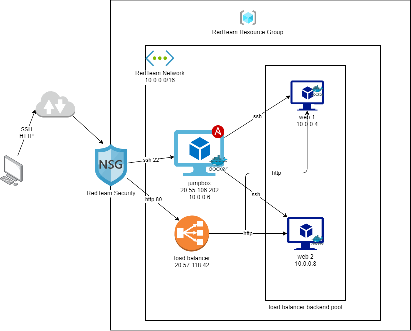
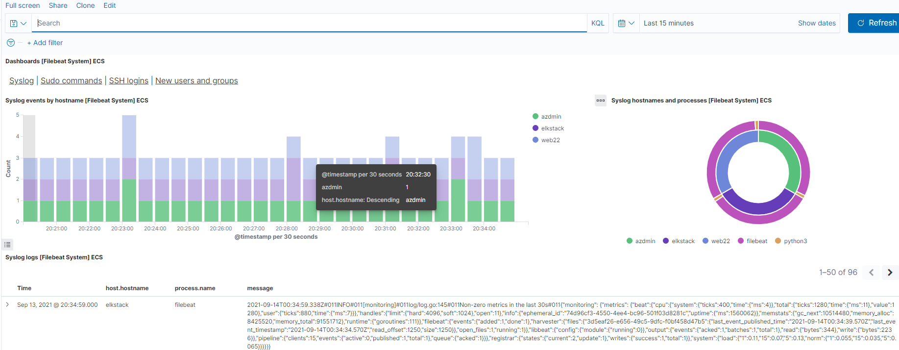

## Automated ELK Stack Deployment

The files in this repository were used to configure the network depicted below.

These files have been tested and used to generate a live ELK deployment on Azure. They can be used to either recreate the entire deployment pictured above. Alternatively, select portions of the playbook file may be used to install only certain pieces of it, such as Filebeat.

  /etc/ansible/elk-playbook.yml

This document contains the following details:
- Description of the Topologu
- Access Policies
- ELK Configuration
  - Beats in Use
  - Machines Being Monitored
- How to Use the Ansible Build

### Description of the Topology

The main purpose of this network is to expose a load-balanced and monitored instance of DVWA, the D*mn Vulnerable Web Application.

Load balancing ensures that the application will be highly efficent, in addition to restricting traffic to the network.
The advantage of the jump box is to allow SSH into the system, and allow access to all of the Virtual Machines plus the ELK. Another advantage of a JumpBox is the orgination point for launching Administrative Tasks. This ultimately sets the JumpBox as a SAW (Secure Admin Workstation). All Administrators when conducting any Administrative Task will be required to connect to the JumpBox (SAW) before perfoming any task/assignment.
Load balancers protects the system from DDoS attacks by shifting attack traffic.
Load Balancing contributes to the Availability aspect of security in regards to the CIA Triad.

Integrating an ELK server allows users to easily monitor the vulnerable VMs for changes to the metrics and system files.
-  What does Filebeat watch for? 
    Filebeat watches for any information in the file system which has been changed and when it has.
    Filebeat watches for log files/locations and collects log events_
- What does Metricbeat record?
   Metricbeat takes the metrics and statistics that collects and ships them to the output you specify.
   Metricbeat records metric and statistical data from the operating system and from services running on the server.

The configuration details of each machine may be found below.
_Note: Use the [Markdown Table Generator](http://www.tablesgenerator.com/markdown_tables) to add/remove values from the table_.

| Name         | Function    | IP Address | Operating System |
|--------------|-------------|------------|------------------|
| Jump Box     | Gateway     | 10.0.0.6   | Linux            |
| web1(adzmin) | webserver   | 10.0.0.4   | Linux            |
| Web2(web22)  |webserver    | 10.0.0.8   | Linux            |
| ElkStack     | monitoring  | 10.2.0.4   | Linux            |

### Access Policies

The machines on the internal network are not exposed to the public Internet. 

Only the Jumpbox machine can accept connections from the Internet. Access to this machine is only allowed from the following IP addresses:
 my public ip address

Machines within the network can only be accessed by the Jumpbox.
- Web1 10.0.0.4
  Web2 10.0.0.8
  Jumpbox 10.0.0.6
A summary of the access policies in place can be found in the table below.

| Name      | Publicly Accessible | Allowed IP Addresses |
|-----------|---------------------|----------------------|
| Jump Box  | Yes                 | my public IP address |
| web1      |  yes                |  10.0.0.4            |
| web2      |  yes                |  10.0.0.8            | 
|  Elkstack |    yes              |  10.2.0.4            |
### Elk Configuration

Ansible was used to automate configuration of the ELK machine. No configuration was performed manually, which is advantageous because...
 It allows you to create several containers at the same time.
The playbook implements the following tasks:
  Install docker.io
  Install Python-pip
  Install docker container
  Launch docker container: elk
  Command: sysctl -w vm.max_map_count=262144

The following screenshot displays the result of running `docker ps` after successfully configuring the ELK instance.

### Target Machines & Beats
This ELK server is configured to monitor the following machines:
web1 10.0.0.4
web2 10.0.0.8

We have installed the following Beats on these machines:
/etc/ansilbe/roles

These Beats allow us to collect the following information from each machine:
- Filebeat monitors log files or locations you specify, collects log events, and forwards them either to Elasticsearch or Logstash for indexing.
- Metricbeat collects metrics from the operating system and from services running on the server.

### Using the Playbook
In order to use the playbook, you will need to have an Ansible control node already configured. Assuming you have such a control node provisioned: 

SSH into the control node and follow the steps below:
- Copy the elk-playbook file to /etc/ansible/.
- Update the Host file to include the IP (10.2.0.4) of the ELKstack
- Run the playbook, and navigate to Kibana to check that the installation worked as expected.

elk-playbook.yml

Update the Ansible host file to make sure that Ansible runs on your specific machines. Then add the elkstack ip to the configuration file in [elk] section to make sure that filebeat and ELK are installed in different containers
Go to http://52.149.161.139:5601/app/kibana to make sure that the elkstack is running.

